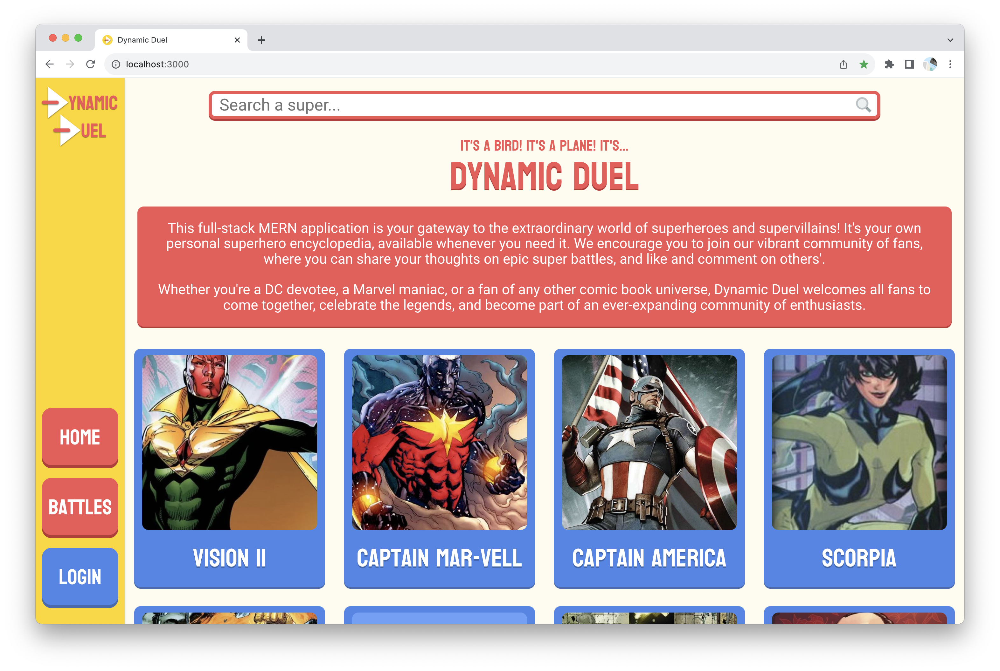
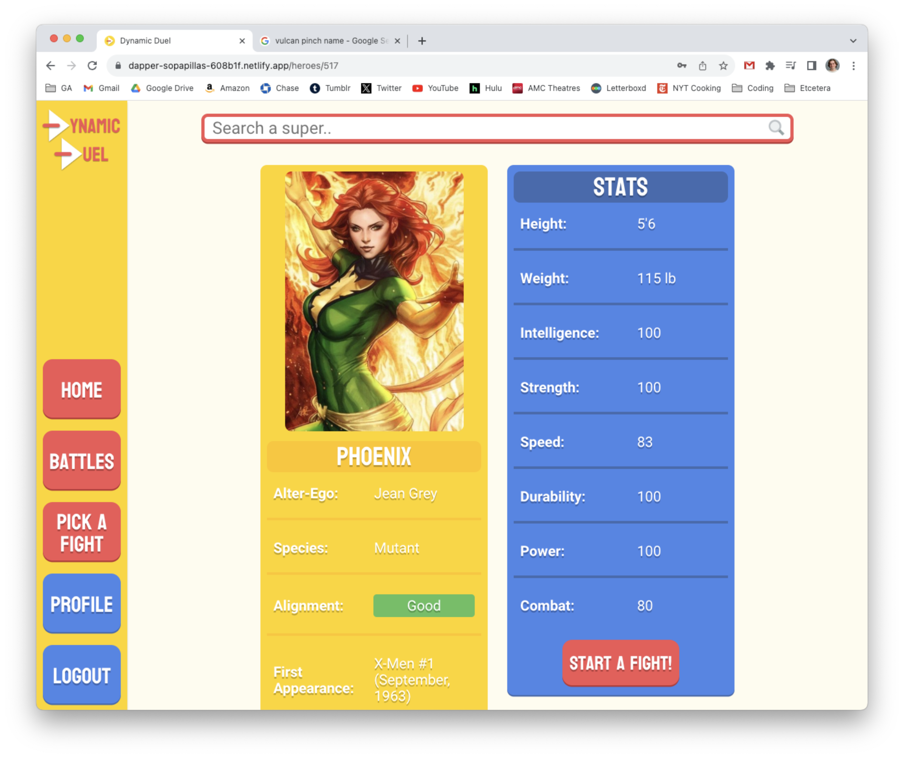
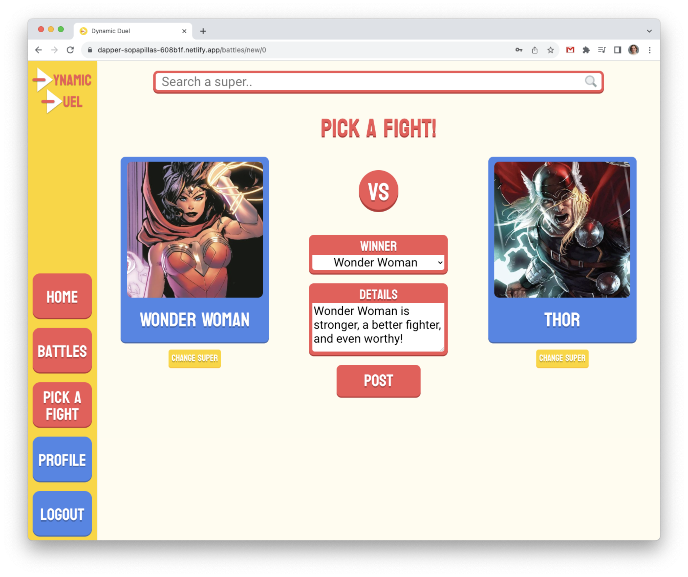
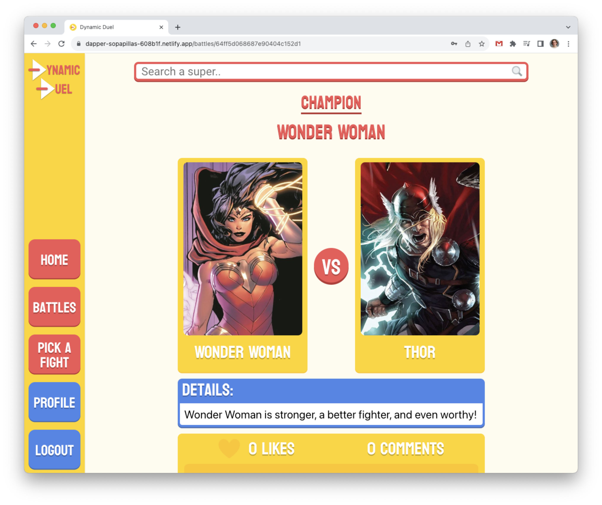
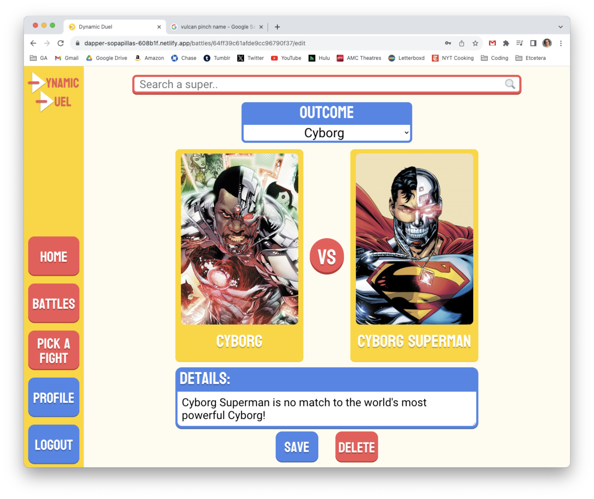
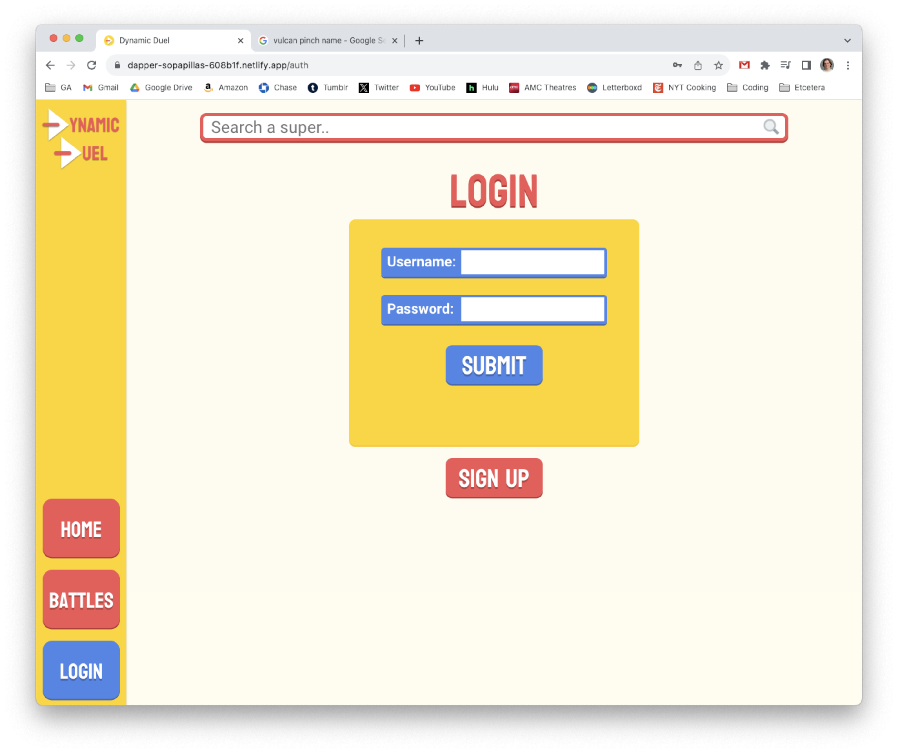
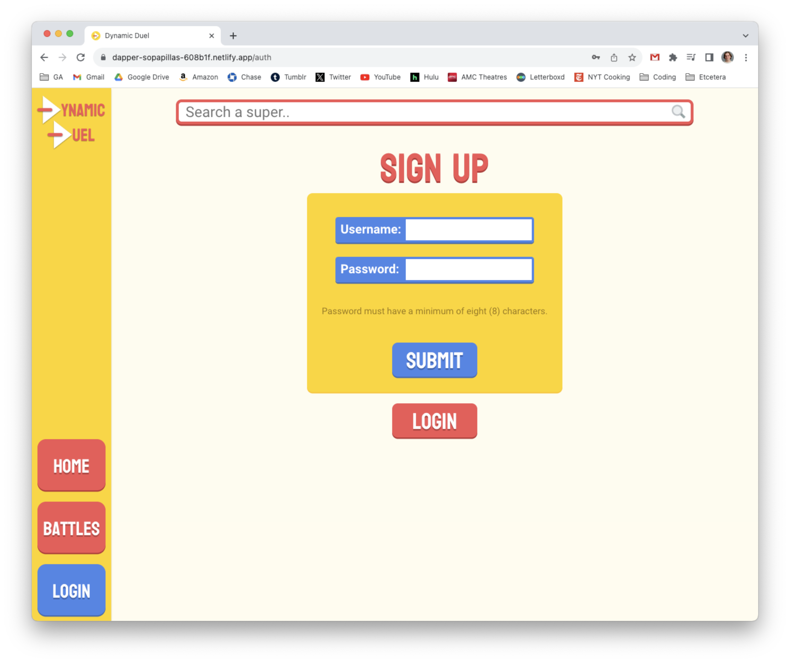

# Dynamic Duel
A full-stack application that allows users to read up on their favorite superheroes and supervillains, login, and pit them against each other in battle.

Find a link to the deployed app [here](https://dapper-sopapillas-608b1f.netlify.app/)

## Screenshots
### Home

### Show Hero

### Battle Index

### Create Battle

### Show Battle

### Edit Battle

### Profile

### Login

### Sign Up

## Technologies Used
- MERN Stack
    - MongoDB and Mongoose
    - Express.js
    - React
    - Node.js
- [3rd Party Superhero Api](https://superheroapi.com/)
- [Heroku for backend deployment](https://www.heroku.com/)
- [Netlify for frontend deployment](https://www.netlify.com/)

## Attributions and Acknowledgements
- [3rd Party Superhero Api used to gather supers information](https://superheroapi.com/)
- [File not found image for heroes without working image links](https://commons.wikimedia.org/wiki/File:File-fav-dynamic-color.png)
- [Maginifying glass icon used in the search bar](https://commons.wikimedia.org/wiki/File:Search-icon.png)
- [Stack overflow resource for using onerror in images](https://stackoverflow.com/questions/34097560/react-js-replace-img-src-onerror)

## Getting Started
Explore the app [here](https://dapper-sopapillas-608b1f.netlify.app/).

Use the searchbar at the top to browse our superheroes on file.  Click their cards to learn more about each hero.  Login (or sign up) to pick fights, pitting super against super!  Determine the outcome, fill in the battle's details, and post.  From there you can browse battles, like your favorites, and post your comments.

## Next Steps
Future features include favoriting up to three superheroes to pin on your user page.  Another is creating a user show page to see other's battles and their top three supers.
