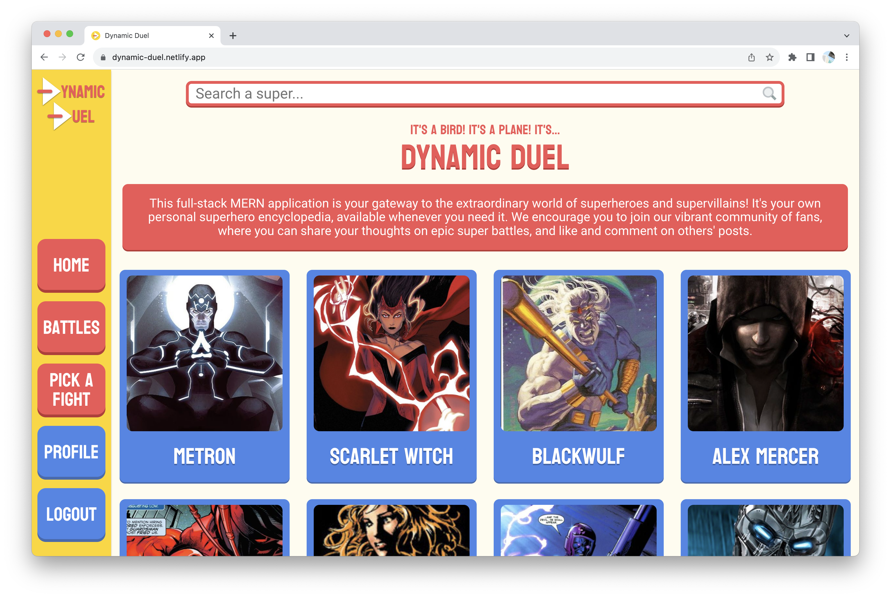
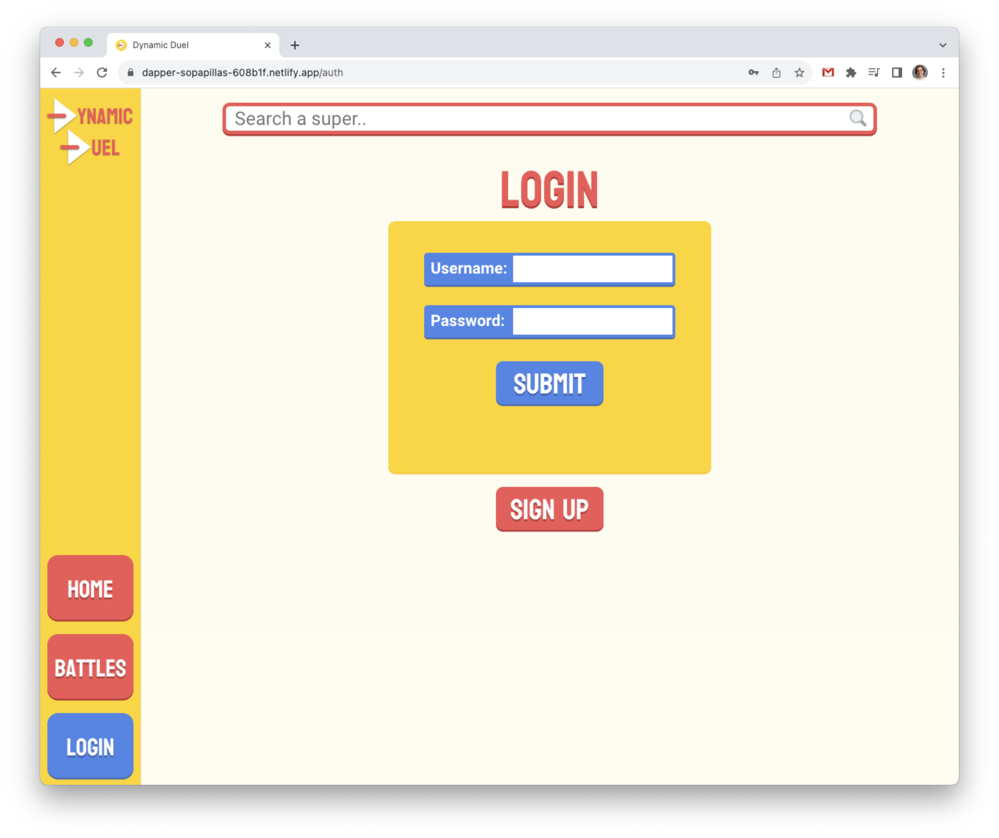

# Dynamic Duel
A full-stack MERN application that allows users to read up on their favorite superheroes and supervillains and make posts about them.  Utilizes a React frontend with AJAX API calls to the Superhero API deployed on Netlify, and an Express.js and Node.js backend deployed on Heroku interacting with a MongoDB database structured by Mongoose schemas.  Built by [Joe Gilberto](https://joekgilberto.com/).

## Deployment
Find the app deployed on Netlify, here: [https://dynamic-duel.netlify.app/](https://dynamic-duel.netlify.app/)

[](https://app.netlify.com/sites/dynamic-duel/deploys)

## Screenshots
### Home

As a user, I want to land on an informational home page when I visit the application.

### Show Super

As a user, I want to be able to gain more information on a super when I navigate to their details page.  I also want to be able to favorite my top three supers.

### Battle Index

As a user, I want to see all of the posts people are making about super battles in reverse chronological order (so I can see the newest posts firsts).

### Create Battle

As a user, I want to be able to create a post about battling supers, prodiving an outcome and details.

### Show Battle

As a user, I want to see the full information on a battle post.  I also want to be able to like and comment on those posts.

### Edit Battle

As a user, I want to be able to edit a post after publishing in case I make a mistake.

### Profile

As a user, I want to be able to see all my favorite supers and battle posts, or the supers and posts of another user, on one page.

### Login

As a returning user, I want to be able to login to see my personalized data.

### Sign Up

As a new user, I want to be able to sign up to create personalized data.

## Technologies Used

Dynamic Duel is a MERN stack application.  In employs a [React](https://react.dev/) frontend deployed on [Netlify](https://www.netlify.com/) that interacts with a [third-party Superhero API](https://superheroapi.com/) and a [Node.js](https://nodejs.org/en) backend with a [Express.js](https://expressjs.com/) framework deployed on [Heroku](https://www.heroku.com/).  The backend interacts with a [MongoDB](https://www.mongodb.com/) database structured by [Mongoose](https://mongoosejs.com/) schemas.

## Attributions and Acknowledgements
Below are specific relevant resources I referenced while building this application.

- [The Superhero API](https://supersuperapi.com/) I used to gather supers information.
- [A public domain file image](https://commons.wikimedia.org/wiki/File:File-fav-dynamic-color.png) I used as an image not found for supers without working image links.
- [A maginifying glass icon](https://commons.wikimedia.org/wiki/File:Search-icon.png) I used in the search bar.
- [A Stack overflow resource for using onerror in images](https://stackoverflow.com/questions/34097560/react-js-replace-img-src-onerror) I used to set default images when a valid image URL was not provided by the Superhero API.


## Instructions for Local Deployment
The following instructions were used through macOS with a silicone M1 chip.

### Fork and clone
To deploy locally, fork and clone this repo.  Then, using the terminal, navigate into the backend directory.

### Install backend dependencies
Install backend dependencies by running:
```
npm i
```

### Create a database
Then, create a [MongoDB database](https://www.mongodb.com/) and retrieve your connection string through the drivers option.

### Create backend environmental variables
Still in the backend directory, create an env file:
```
touch .env
```
Within that .env file, add that connection string to a DATABASE_URI vairable, a PORT variable with a port number for your backend to run on and for your frontend to connect to, and a JWT_SECRET vairable of your choosing:
```
DATABASE_URI='<connection string>
PORT=<a number, typically 4000>
JWT_SECRET='<your secret>'
```

### Spin up backend server
For the final step of your backend set up, spin up the server with the following command:
```
 nodemon
```

### Install frontend dependencies
For the first step of your frontend set up, navigate into your frontend directory via your terminal and install your dependencies.
```
npm i
```

### Create a Superhero Api token
Go to [Superhero API](https://www.superheroapi.com/) and create an access token by logging in through Facebook.

### Create frontend environmental variables
Next, create your environmental variables:
```
touch .env.local
```
Then, add your database environmental variables to interact with your backend (running on localhost at the PORT defined in your backend .env):
```
REACT_APP_API_URL=https://www.superheroapi.com/api.php/<your access token>
REACT_APP_AUTH_URL=http://localhost:<PORT>/auth
REACT_APP_BATTLE_URL=http://localhost:<PORT>/battles
REACT_APP_LIKES_URL=http://localhost:<PORT>/likes
REACT_APP_COMMENTS_URL=http://localhost:<PORT>/comments
```

### Spin up your frontend server
Finally, while still in your frontend directory, spin up your front server:
```
npm start
```

### Browse
Now, you can go to localhost:3000 in your browser (Google Chrome is reccommended for best performance) and browse the application.


## Current User Flow
Explore the app here: [https://dynamic-duel.netlify.app/](https://dynamic-duel.netlify.app/)

Use the searchbar at the top to browse our supers on file.  Click their cards to learn more about each super.  Login (or sign up) to pick fights, pitting super against super, and favorite your top three supers!  Determine the outcome, fill in the battle's details, and post.  From there you can browse battles, like them, and post your comments.  You even have a personal user pages to view your top three supers and the battles you've created- and the user pages of others too!

## Future Features
Features to be added in further edits:
- Raking the top three supers on your user page
- Creating a page specifically to edit a user's own favorite supers, utilizing a search funciton and the ability to save results