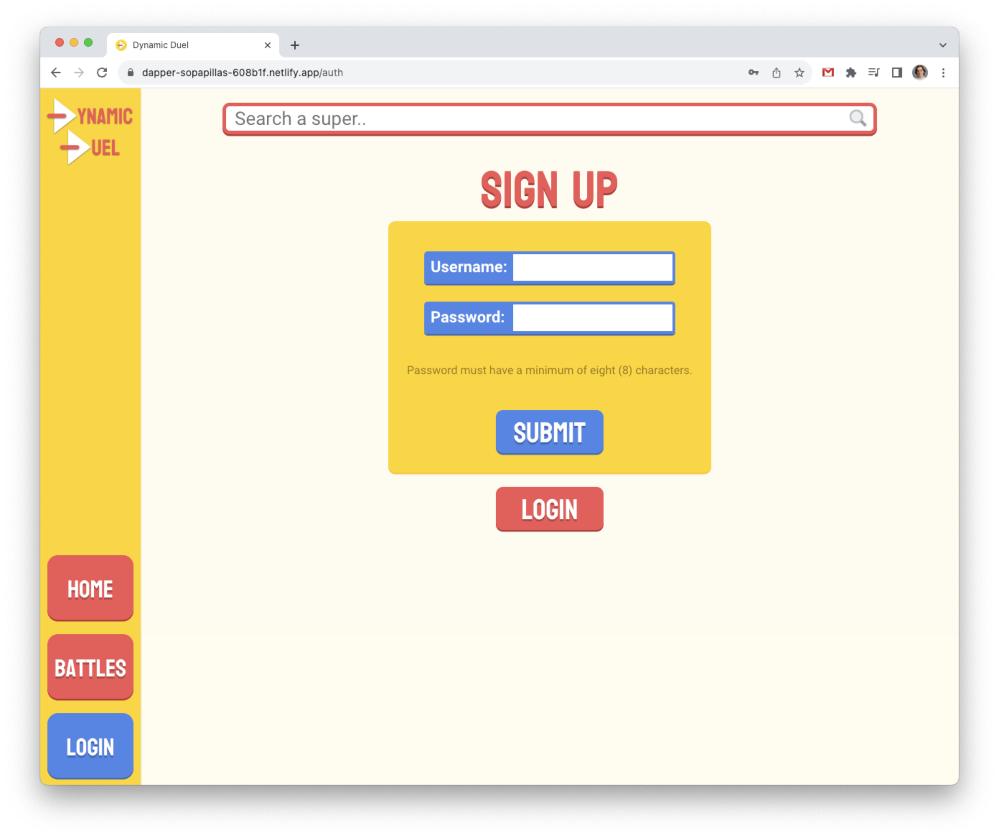

# Dynamic Duel
A full-stack application that allows users to read up on their favorite superheroes and supervillains, login, and pit them against each other in battle.

Find a link to the deployed app [here](https://dynamic-duel.netlify.app/).

## Screenshots
### Home

### Show Super

### Battle Index

### Create Battle

### Show Battle

### Edit Battle

### Profile

### Login

### Sign Up

## Technologies Used
- MERN Stack
    - MongoDB and Mongoose
    - Express.js
    - React
    - Node.js
- [3rd Party Supersuper Api](https://supersuperapi.com/)
- [Heroku for backend deployment](https://www.heroku.com/)
- [Netlify for frontend deployment](https://www.netlify.com/)

## Attributions and Acknowledgements
- [3rd Party Supersuper Api used to gather supers information](https://supersuperapi.com/)
- [File not found image for supers without working image links](https://commons.wikimedia.org/wiki/File:File-fav-dynamic-color.png)
- [Maginifying glass icon used in the search bar](https://commons.wikimedia.org/wiki/File:Search-icon.png)
- [Stack overflow resource for using onerror in images](https://stackoverflow.com/questions/34097560/react-js-replace-img-src-onerror)

## Getting Started
Explore the app [here](https://dynamic-duel.netlify.app/).

Use the searchbar at the top to browse our supers on file.  Click their cards to learn more about each super.  Login (or sign up) to pick fights, pitting super against super!  Determine the outcome, fill in the battle's details, and post.  From there you can browse battles, like your favorites, and post your comments.  You even have personal user pages to see your top three supers and the battles you've created- and the user pages of others!

## Next Steps
Future features include raking the top three supers on your user page.  Another is creating ad edit favorites page to search and save supers from a user page.
