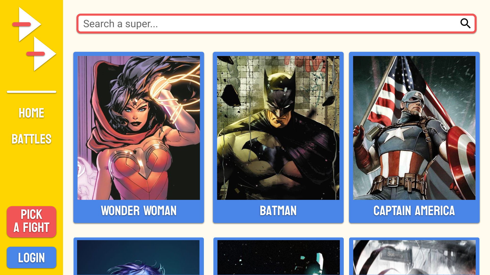
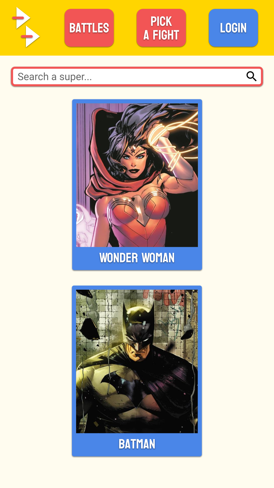
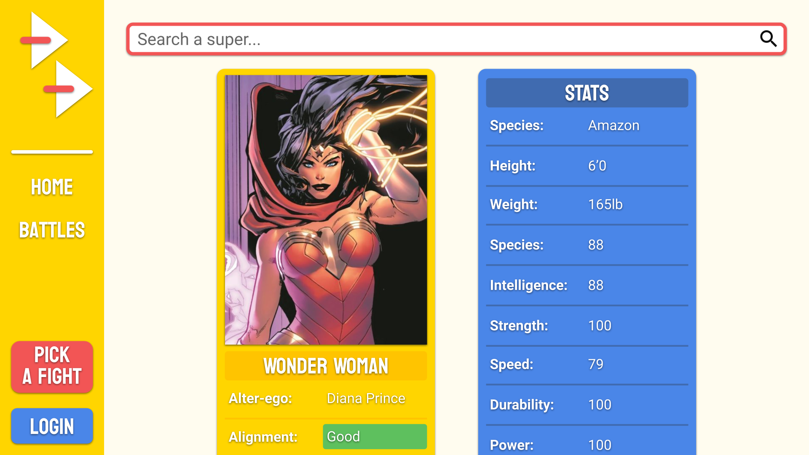
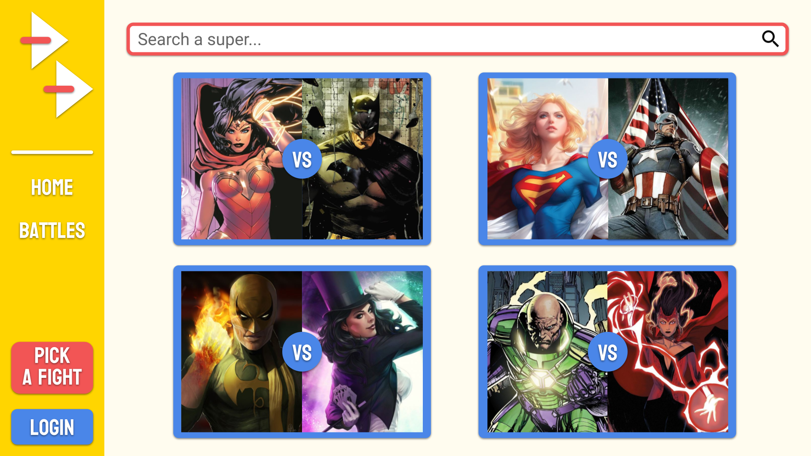
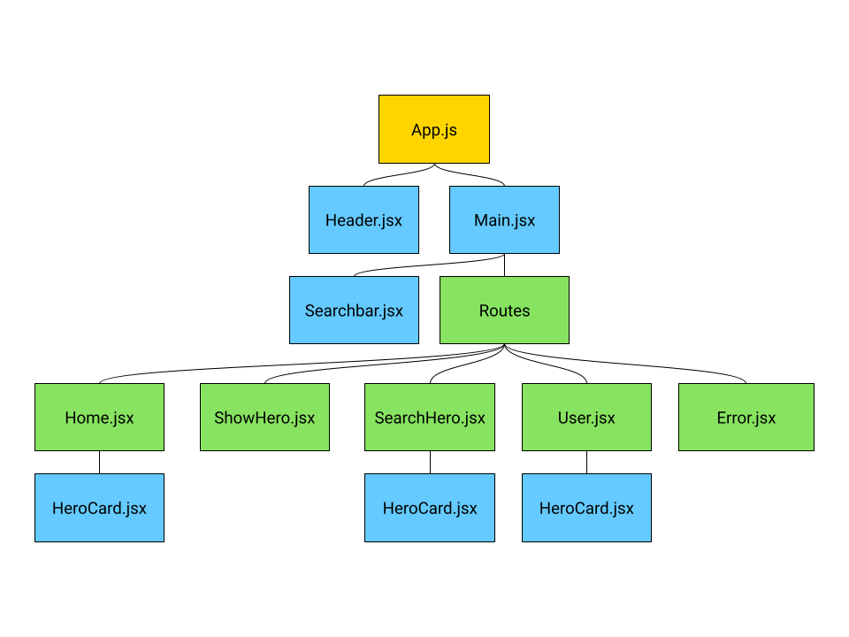
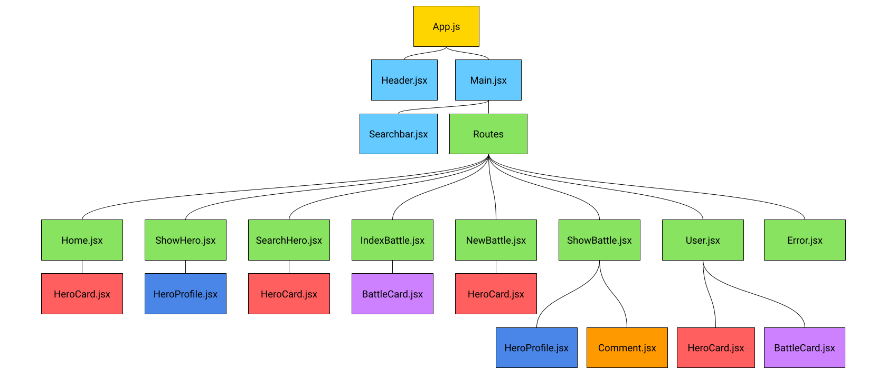
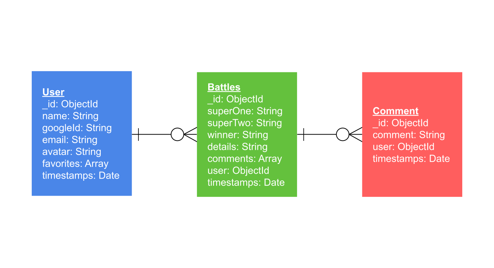
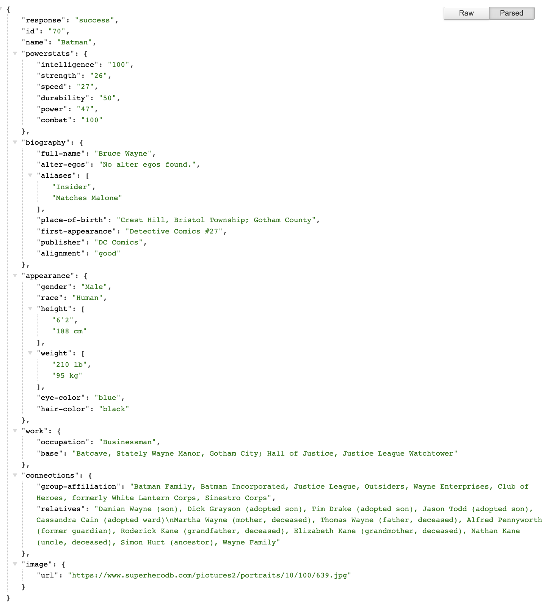

# Dynamic Duel
## Project Summary
A full-stack application that allows users to read up on their favorite superheroes and supervillains, and even pit them against each other.

## Trello
[Found here](https://trello.com/b/e1IHm99d/project-3-dynamicduel)

## Wireframes
### Index

### Index Mobile

### Show

### Battles (Icebox)

## Component Trees
### MVP Tree

### Icebox Tree

## Models
### MVP
#### Primary Model - Users
|**Property**|**DataType**|
| - | - |
| _id | Objectid |
| name | String |
| googleId | String |
| email | String |
| avatar | String |
| favorites | Array |
| timestamps | Date |

### Icebox
#### Secondary Model - Battles
|**Property**|**DataType**|
| - | - |
| _id | Objectid |
| superOne | String |
| superTwo | String |
| winner | String |
| details | String |
| comments | Array |
| user | ObjectId |
| timestamps | Date |

#### Tertiary Model - Comments
|**Property**|**DataType**|
| - | - |
| _id | Objectid |
| comment | String |
| user | ObjectId |
| timestamps | Date |

## ERD
### Icebox

## JSON Example
